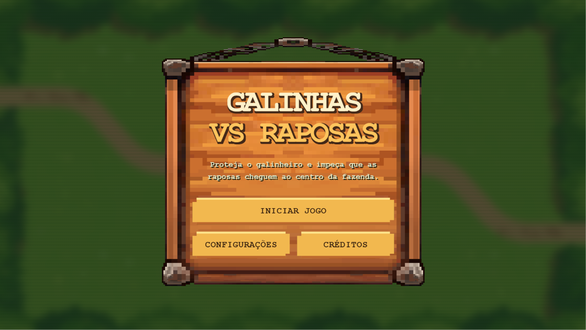
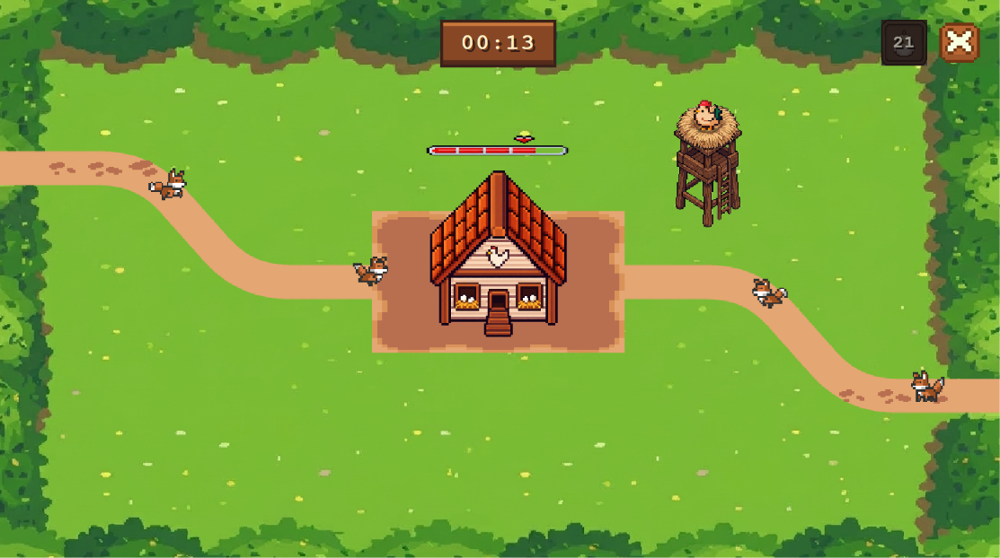
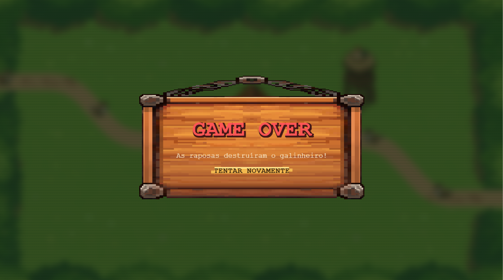

# TP1
Trabalho Prático 1  - Tower Defense - Projeto desenvolvido para a disciplina de Computação Gráfica.

## Sobre o jogo
 Galinhas vs Raposas é um jogo no estilo Tower Defense. 
 
O jogador deve proteger o galinheiro, localizado no centro da cenário, contra o ataque das raposas. 
As raposas surgem das laterais da tela e seguindo o caminho estipulado se encaminham para o galinheiro. Para impedir para que elas alcancem o galinheiro e matem as galinhas, o jogador deve construir novas torres, as quais possuem galinhas atiradoras que jogam seus ovos nas raposas para causar danos, porém é necessário atenção ao posicionar as torres, pois o número é limitado a uma torre a cada 10 segundos. Outra maneira de causar danos é clicando nas raposas.
A dificuldade aumenta com o passar do tempo, pois as raposas passam a aparecer em maior quantidade.
Seu objetivo é sobreviver o maior tempo possível, acumulando pontos antes que as raposas destruam o galinheiro!

## Criadoras
Nome: Caroline Elizabeth Leroy Alves
Contato: +55 (31) 98947-0074

Nome: Clara Liberal Barbi 
Contato: +55 (31) 99846-2872

## Media kit

Tela Inicial:

Jogo em Andamento:

Tela Final / Game Over:

## Itens implementadas

Além dos itens obrigatórios, inserimos as seguintes características (obrigatórias/opcionais)

1. Texturas animadas: Raposas, galinhas e barra de vida animadas 
2. Telas: Menu incial, créditos, game over, reiniciar
3. Sons: O jogo possui música inicial, música de fundo e efeitos sonoros no inicio e fim do jogo
4. Caminhos ds inimigos: Os inimigos seguem um caminho de waypoints suavizado até o centro do galinheiro
5. Novas torres: O jogador tem a possibilidade de inserir novas torres a medida que passa o tempo do jogo
6. Controle de volume nas configurações do menu

## Créditos 

Todas as texturas usadas foram retiradas do site: https://itch.io

